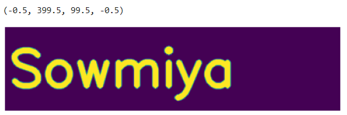
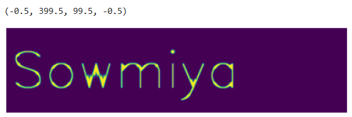
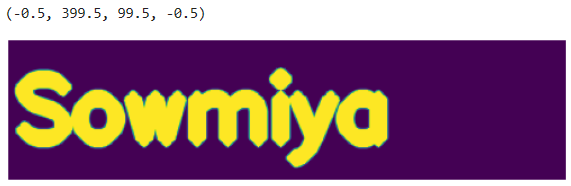

# Implementation-of-Erosion-and-Dilation
## Aim
To implement Erosion and Dilation using Python and OpenCV.
## Software Required
1. Anaconda - Python 3.7
2. OpenCV
## Algorithm:
### Step1:
Create a blank image using NumPy.
    
### Step2:
Add text to the image using cv2.putText.


### Step3:
Define a structuring element for morphological operations.


### Step4:
Perform erosion on the image using cv2.erode.
### Step5:
Perform dilation on the image using cv2.dilate.

 
## Program:

``` Python
# Import the necessary packages
import cv2
import numpy as np
from matplotlib import pyplot as plt

# Create the Text using cv2.putText
img1 = np.zeros((100,400),dtype = 'uint8')
font = cv2.FONT_HERSHEY_SIMPLEX
cv2.putText(img1 ,'Sowmiya',(5,70),font,2,(255),5,cv2.LINE_AA)
plt.imshow(img1)
plt.axis('off')    

# Create the structuring element
kernel = np.ones((5,5),np.uint8)
kernel1 = cv2.getStructuringElement(cv2.MORPH_CROSS,(7,7))
cv2.erode(img,kernel)

# Erode the image
img_erode = cv2.erode(img1,kernel1)
plt.imshow(img_erode)
plt.axis('off')

# Dilate the image
img_dilate = cv2.dilate(img1,kernel1)
plt.imshow(img_dilate)
plt.axis('off')

```
## Output:

### Display the input Image


### Display the Eroded Image


### Display the Dilated Image


## Result
Thus the generated text image is eroded and dilated using python and OpenCV.
